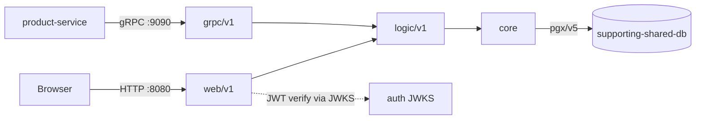

# AGENTS.md

Agent-focused guide for `review-service`. Keep changes minimal, verified against
the code, and consistent with existing patterns.

## Contribution workflow

- Never push to `main`. Branch, then open a PR.
- Branch names use conventional prefixes: `feat/`, `fix/`, `docs/`, `chore/`,
  `refactor/`, `test/`.
- One logical change per PR. PRs are merged with squash.
- Commit subject: imperative mood, capitalised, no trailing period, ≤ 50 chars
  (`Add gRPC reflection`, not `Added` / `Adds`).
- Commit body (only when non-trivial): explain *what* and *why*, wrap at 72 chars,
  one blank line after the subject.
- No attribution trailers (`Signed-off-by`, `Co-authored-by`, `Generated-by`, …).
- No issue references (`Fixes #123`) and no `@`-mentions in commit messages.
  Put issue links in the PR description.

## Code quality

- Go 1.26 (`go.mod` pins the toolchain; `GOTOOLCHAIN=auto` selects it).
- Idiomatic Go: small interfaces, constructor injection, wrapped errors
  (`fmt.Errorf("...: %w", err)`), sentinel errors in `internal/logic/v1/errors.go`.
- Always check error returns (or explicit `_ = fn()`).
- `errors.New` when there are no format verbs; `net.JoinHostPort` over
  `fmt.Sprintf("%s:%s", …)`; `http.NewRequestWithContext` over `http.NewRequest`.
- Extract repeated string literals to constants; split helpers to keep
  cognitive complexity down.
- Lint must pass (`golangci-lint`, v2 config in `.golangci.yml`). PRs with lint
  errors are not merged; CI runs it on every PR (`go-check`).
- Before pushing or opening a PR, verify Sonar new-code coverage ≥80%: run
  `go test -race -coverprofile=coverage.out ./...` and confirm changed lines are
  covered, including BOTH branches of any new conditional. `**/cmd/**`,
  `**/db/migrations/**`, `**/core/repository/**` are coverage-excluded;
  everything else counts.

## Project overview

Product review microservice. Manages product reviews and ratings.

- Module path: `github.com/duynhlab/review-service`.
- HTTP server on `:8080` (north-south, browser + in-cluster callers).
- gRPC server on `:9090` (east-west).
- Both transports always run; gRPC is the official east-west transport.

## Repository layout

```
review-service/
├── cmd/main.go                 # Wiring, dual HTTP+gRPC bootstrap, graceful shutdown
├── config/config.go            # Env-driven config + validation (12-factor)
├── db/migrations/
│   ├── embed.go                # embed.FS exposing the SQL migrations
│   └── sql/                    # golang-migrate migrations (000001_*.up.sql), embedded via embed.go
├── internal/
│   ├── web/v1/handler.go       # HTTP transport adapter
│   ├── grpc/v1/server.go       # gRPC transport adapter
│   ├── logic/v1/               # Business rules (service.go, errors.go)
│   └── core/                   # database.go, domain/, repository/
└── middleware/                 # Tracing, logging, metrics, profiling
```

## Build, test, lint

```bash
GOTOOLCHAIN=auto go build ./...
GOTOOLCHAIN=auto go vet ./...
GOTOOLCHAIN=auto go test ./...     # CI runs with -race -coverprofile
golangci-lint run                  # must pass before commit
```

### Testing conventions

- **Unit tests** — stdlib `testing` only (no testify/gomock), hand-written mocks for
  interfaces, table-driven subtests, in `*_test.go` next to the code: Web (`httptest`),
  Logic (pure — mock the repo), gRPC (call handlers directly), `middleware`, `config`. Run
  with `go test ./...` (no Docker).
- **Integration tests** — `internal/core/repository` is tested against a **real Postgres**
  via testcontainers, build-tagged `//go:build integration` (the default `go build`/`go test`
  skip them, so the binary never links testcontainers). Run locally with Docker:
  `go test -tags=integration ./internal/core/repository/...`. CI wires `integration: true`
  (go-check) + `integration-coverage: true` (sonar), and merges both coverage profiles into
  the ≥ 80% new-code gate.
- **Before pushing**, both the unit run *and* the integration suite must be green locally —
  green unit ≠ green CI (CI also runs integration with Docker).

## Conventions

### 3-layer architecture

Dependency flows one way: `web → logic → core` (never reverse).

| Layer | Location | Allowed | Forbidden |
|-------|----------|---------|-----------|
| Web | `internal/web/v1/` | HTTP, JSON binding, DTO mapping, call Logic, aggregation | SQL, direct DB, business rules |
| gRPC | `internal/grpc/v1/` | gRPC transport, map domain↔proto, call Logic | SQL, direct DB, business rules |
| Logic | `internal/logic/v1/` | Business rules, call repository interfaces, domain errors | SQL, `database.GetPool()`, `*gin.Context` |
| Core | `internal/core/` | Domain models, repository impls, SQL, DB connection | HTTP handling, orchestration |

Web and gRPC are sibling transport adapters over the same Logic service; neither
holds business logic. Use constructor injection for all dependencies.

### gRPC server (east-west)

- Exposes `review.v1.ReviewService/GetProductReviews` on `:9090`, called by
  `product-service` for product-details aggregation.
- Mirrors `GET /review/v1/public/reviews?product_id=…` and returns identical data.
- Built via `pkg/grpcx` (OpenTelemetry stats handler, health service, reflection).

### JWT validation (auth)

- Validates JWTs on `private` HTTP routes via `pkg/authmw`, verifying RS256
  tokens locally against the auth service's JWKS (`AUTH_JWKS_URL`).

### Observability (`pkg/obsx`)

- HTTP middleware chain order: tracing → logging → metrics.
- `obsx.SetupMetrics()` bridges OTel metrics into the default Prometheus registry.
  gRPC RED (`rpc_server_*`) and HTTP RED metrics share the single
  `/metrics` endpoint — no separate port.
- Logging middleware stamps the active span via `obsx.TraceIDFromContext`,
  falling back to header/generated trace IDs.

### Diagrams

Use Mermaid only — no ASCII art.



## Gotchas

- The gRPC server (`internal/grpc/v1/server.go`) is a transport peer of Web: it
  calls Logic through the narrow `ReviewLister` interface and never touches the DB.
- Kyverno image rules: reference `ghcr.io/duynhlab/<service>:<sha>` or `:vX.Y.Z` —
  never `:latest`.
- Migrations run via golang-migrate from the `migrate` subcommand; the init
  container reuses the app image (`args: ["migrate"]`). SQL files are embedded
  through `db/migrations/embed.go` (`embed.FS`), so no separate image is built.
- Database is `supporting-shared-db` (Zalando Postgres Operator), reached through
  the PgBouncer pooler (`DB_HOST`); migrations connect direct (no pooler). pgx is
  configured for transaction-mode pooling (simple protocol, prepared-statement and
  description caches disabled) so it works behind PgBouncer.
